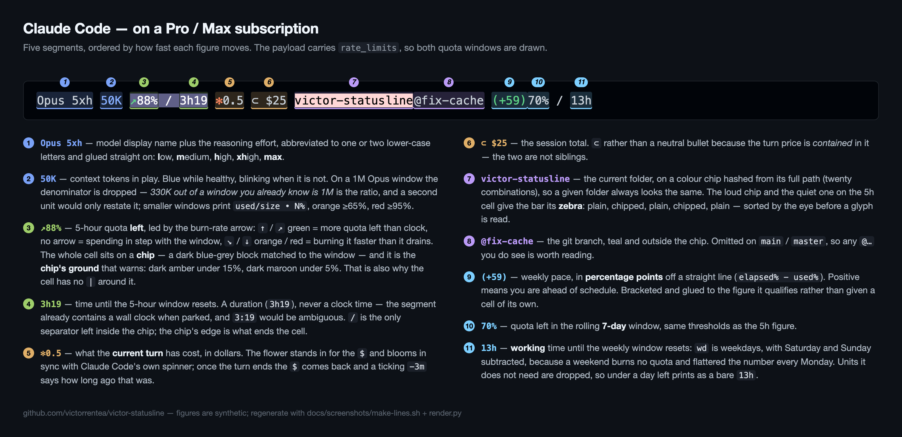
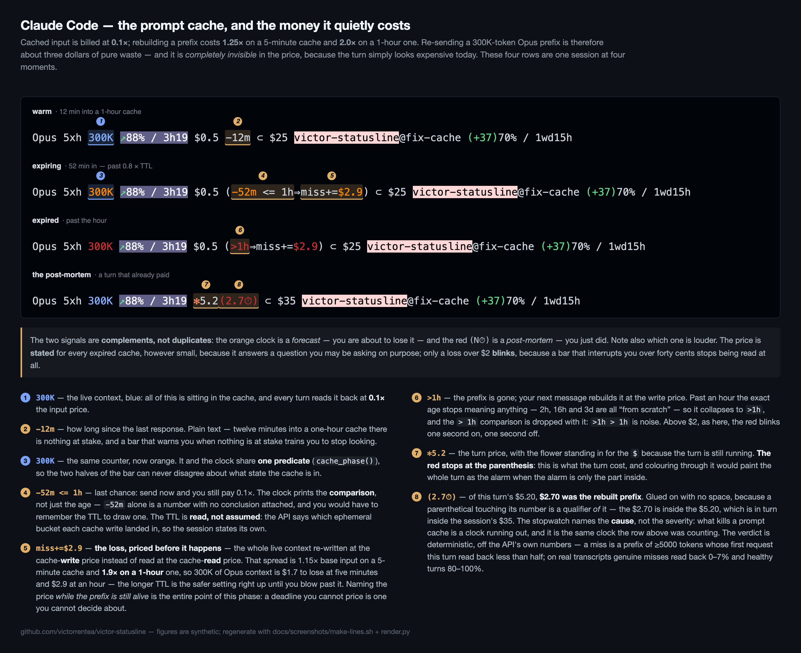
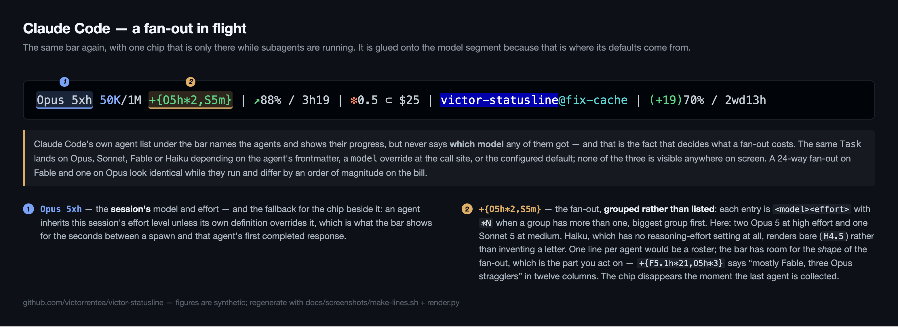
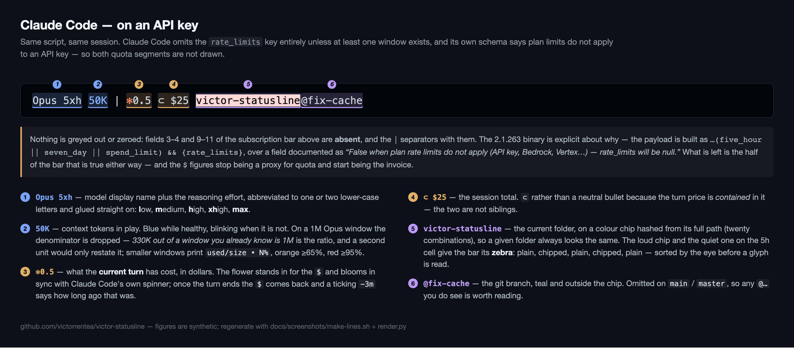
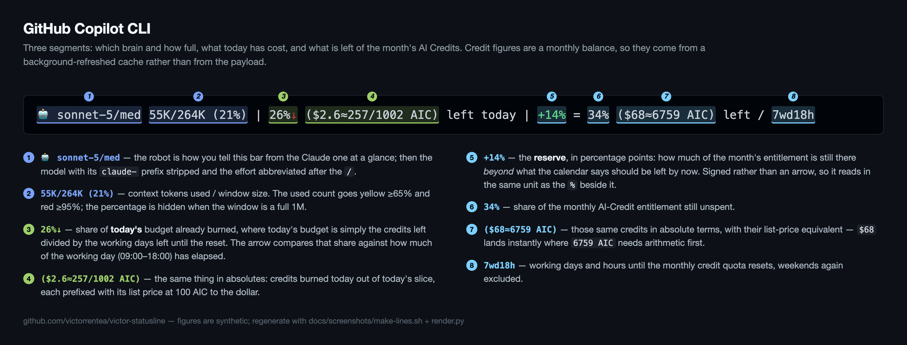

# victor-statusline

Rich, information-dense status lines for **Claude Code** and **GitHub Copilot
CLI** — the one-line bar at the bottom of the terminal that tells you what the
agent is costing you, how much quota is left, and whether you are about to throw
money away.

Both are plain shell scripts with no dependencies beyond `jq`, `awk`, `bc` and
`python3`. Take them as they are, or read the docs and build your own — each doc
explains not just *what* every glyph means but *why* it was designed that way,
which is the part worth stealing.

```
Opus 4.8/xhigh 50K/1M | ↗98% left / 4:47 | ✻0.5 ⊂ $25 | +24% = 70% / 1d1h
🤖 opus-4.8 · high · 55K/1M | 6759 AIC (96%)↗ left | resets in 7d 4h
```

## What the bar actually says

Five annotated shots, one per situation. Every figure in them is synthetic —
they are rendered from the real scripts fed hand-written payloads, so nothing
here is anyone's actual quota or spend (`docs/screenshots/`).

**Claude Code on a Pro/Max subscription** — the full five segments:



**The part that pays for itself** — the prompt-cache clock. Cached input bills
at 0.1×, rebuilding a prefix at 1.25× (5-minute cache) or 2.0× (1-hour), so
walking away for an hour with 300 K of Opus context loaded costs about three
dollars the moment you type again — and nothing on screen would otherwise say
so, because the turn just looks expensive. Four moments of one session: warm,
about to expire (the loss **priced before it happens**), expired, and the
post-mortem on a turn that already paid it:



**A fan-out in flight** — the one chip that is not always there. Claude Code's
own agent list never says *which model* each subagent got, and that is what
decides whether a 24-way fan-out costs cents or tens of dollars:



**Claude Code on an API key** — the same script and the same session. Claude Code
builds the payload as `...(five_hour || seven_day || spend_limit) && {rate_limits}`,
over a field its own schema documents as *"False when plan rate limits do not
apply (API key, Bedrock, Vertex, or missing profile scope) — rate_limits will be
null"*. So on an API key the key is absent, not zero, and the two quota segments
are not drawn at all — the bar is what remains:



**GitHub Copilot CLI** — a different script, deliberately the same idioms: pace
first, absolutes in brackets, working-day clocks:



## What's here

| Path | What it is |
|------|------------|
| [`claude/victor-claude-statusline.md`](claude/victor-claude-statusline.md) | **Claude Code** status line — full reference and design rationale |
| `claude/statusline-command.sh` | the script it documents |
| `claude/hooks/quota-state.sh`, `quota-probe.sh`, `quota-gate.sh` | the machine-wide quota state it merges into, the live probe that keeps that state honest across a plan switch, and the request gate that parks a terminal on an exhausted window |
| [`copilot/victor-copilot-statusline.md`](copilot/victor-copilot-statusline.md) | **GitHub Copilot CLI** status line — full reference |
| `copilot/statusline.sh`, `copilot/quota-refresh.sh` | the scripts it documents |
| `check-sync.sh` | verifies each doc's embedded copy still matches the real script |
| `docs/screenshots/` | the annotated pictures above, plus the two scripts that regenerate them |

Each doc **embeds a verbatim copy** of its scripts, so a single markdown file is
enough to hand to someone — or to paste at an agent and say "set this up for me".
`check-sync.sh` is what keeps those copies honest.

## Install — let the agent do it

Both docs open with a "let your CLI configure itself" section. From a clone of
this repo:

**Claude Code** — run `claude` and paste:

> Read `claude/victor-claude-statusline.md` and set me up an identical status
> line: create `~/.claude/statusline-command.sh` exactly as in the doc,
> `chmod +x` it, and wire the `statusLine` block into `~/.claude/settings.json`
> (merge with the existing JSON, don't clobber it). Then verify by piping a
> sample payload into the script.

**Copilot CLI** — run `copilot` and paste:

> Read `copilot/victor-copilot-statusline.md` and set me up an identical Copilot
> CLI status line, following the TL;DR section in that file.

## Install — by hand

```sh
# Claude Code
install -m 755 claude/statusline-command.sh  ~/.claude/statusline-command.sh
install -m 755 claude/hooks/quota-*.sh       ~/.claude/hooks/
```

then add to `~/.claude/settings.json`:

```json
{
  "statusLine": { "type": "command", "command": "~/.claude/statusline-command.sh", "refreshInterval": 1 }
}
```

```sh
# Copilot CLI
install -m 755 copilot/statusline.sh    ~/.copilot/statusline.sh
install -m 755 copilot/quota-refresh.sh ~/.copilot/quota-refresh.sh
bash ~/.copilot/quota-refresh.sh          # prime the quota cache
```

then add the `statusLine` block from `copilot/victor-copilot-statusline.md`
(File 3) to `~/.copilot/settings.json`.

## Caveats worth knowing before you install

- **macOS/BSD assumptions.** `date -r`, `stat -f` and friends are BSD flavours;
  on Linux they need the GNU spellings.
- **The Claude bar depends on sibling hooks.** `turn-state.sh` (turn
  boundaries) is not shipped here; the quota trio under `claude/hooks/` is —
  `quota-state.sh` (cross-terminal merge), `quota-probe.sh` (asks the account
  every five minutes, so a plan switch shows within minutes instead of at the
  next window reset), `quota-gate.sh` (parks a terminal on an exhausted
  window). Without them it still runs and degrades to its fallback heuristics;
  the doc says exactly where.
- **Nothing here sets the session title**, deliberately: any hook that emits
  `sessionTitle` permanently suppresses Claude Code's own AI summary, which is
  also what `/resume` lists sessions by. §6 of the Claude doc has the evidence
  from the binary, and explains why the location belongs in the bar instead.
- The Copilot bar reads an **undocumented** endpoint (`copilot_internal/user`)
  for the credit figures; field names can change between CLI versions.

## Maintaining

The scripts and their docs are **one unit**: a behaviour change must update the
script, the prose, and the embedded copy in the same commit. Run `./check-sync.sh`
before pushing.

The screenshots are generated, not captured, so they cannot go stale silently —
but they do have to be re-run when a segment changes shape:

```sh
./docs/screenshots/make-lines.sh      # sample payloads -> docs/screenshots/lines/*.ansi
python3 docs/screenshots/render.py    # *.ansi + the field notes -> *.png
```

`render.py` locates each annotated field by a **regex**, not by its literal
value, and dies loudly if one stops matching or two start overlapping — so a
renamed or reshaped segment fails the render instead of quietly mislabelling the
picture.
